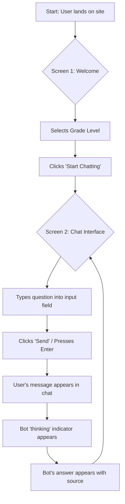

# ibe160 UX Design Specification

_Created on 2025-11-20 by BIP_
_Generated using BMad Method - Create UX Design Workflow v1.0_

---

## Executive Summary

Sentiabot is an AI-powered educational tool designed to provide elementary school students (ages 6-12) with safe, reliable, and easy-to-understand answers for their schoolwork, initially focusing on the science curriculum (Biology & Geology). The core experience revolves around an interactive chat with an AI chatbot, where the chat window itself is the most critical element. The goal is to create a trustworthy, engaging, and minimalist web application that makes students feel **efficient**, **productive**, and **curious**.

The design will heavily draw inspiration from existing, successful AI chat applications like ChatGPT and Google Gemini, prioritizing a **simple and to-the-point** interface. Key design principles will include a conversation-focused UI, effortless input mechanisms, clear presentation of information sources to build trust, and consistent, predictable interactions. The application will be accessible on desktops, laptops, and tablets, with UX complexity assessed as low due to the focused nature of the core interaction. The design will ensure the text input is always obvious, inviting, and persistently available, while minimizing UI "chrome" to prevent distraction.

---

## 1. Design System Foundation

### 1.1 Design System Choice

**Decision:** Shadcn UI

**Rationale:**
Given the project's technical stack (Next.js, Tailwind CSS) and the goal of a "simple, minimalistic, and engaging user interface," Shadcn UI is the ideal choice. It offers unparalleled flexibility, allowing for a custom and minimalist aesthetic that aligns perfectly with the project vision. Its foundation on Radix UI primitives ensures strong accessibility, which is crucial for the target audience of elementary school students. By providing full control over component code, Shadcn UI facilitates precise customization and integration within the existing frontend framework, enabling the creation of a unique and unconstrained user experience.

---

## 2. Core User Experience

### 2.1 Defining Experience

The core experience for Sentiabot is the interactive conversation with the AI chatbot. Users will primarily engage with the chatbot to ask questions and receive answers.

The most critical interaction to get right is the chat window itself, ensuring a seamless and intuitive experience for elementary students. Finding the text input field to type questions should be effortless and immediately discoverable.

The application will be a web application, accessible on desktop computers, laptops, and tablets.

#### Desired Emotional Response

The primary emotional goals for the user experience are to make the student feel:
- **Efficient and Productive:** The tool should feel fast and helpful, enabling students to find the information they need without friction.
- **Curious:** The experience should encourage exploration and a desire to learn more. It should spark new questions rather than just ending a line of inquiry.

#### Inspiration and Competitive Analysis

The user identified several leading AI chat applications as inspiration, including **ChatGPT**, **Google Gemini**, and **Claude.ai**. The common thread is that their user experience is **simple and to the point.**

Analysis of these products reveals several key design principles that are highly relevant for Sentiabot:

1.  **Minimalist, Conversation-Focused Interface:** The UI is dominated by the chat history and a clear input area. This singular focus reduces cognitive load and makes the application's purpose immediately clear.
2.  **Effortless Input:** The text input field is the primary call to action on the screen. It is always visible, accessible, and ready for user input.
3.  **Clarity and Trust:** While providing complex information, these tools prioritize clarity in their presentation. For Sentiabot, this principle will be applied by ensuring that sources for information are clearly and simply cited with each response, building trust and reinforcing the educational mission.
4.  **Predictable and Consistent Interaction:** The core interaction loop (user asks, bot responds) is consistent and reliable. This predictability is crucial for making a tool feel easy to use, especially for younger audiences.

**Actionable Insights for Sentiabot:**
*   The chat window is the application. The design will center entirely around the conversation.
*   The text input must be obvious, inviting, and persistently available.
*   UI "chrome" (menus, buttons, settings) will be kept to an absolute minimum to avoid distraction.
*   A core design challenge will be presenting source information in a way that is clear and useful to a child, without cluttering the interface.
*   The UI will be designed to feel responsive and fast to support the feeling of efficiency.

### 2.2 Defining Experience (User Confirmation)

The **defining experience** for Sentiabot is: "the app where you can ask science questions and get simple, sourced answers."

This statement encapsulates the core value proposition and the primary interaction users will have with the application.

### 2.3 Established UX Patterns

The core interaction of asking questions and receiving answers is based on well-established UX patterns for conversational AI.

*   **Conversational UI:** The fundamental structure of a chat interface, including an input field for user queries and a scrollable history of messages.
*   **Information Retrieval and Display:** Presenting answers clearly and concisely, alongside associated metadata (like sources).
*   **Contextual Cues:** Indications of the chatbot's activity (e.g., typing indicators), and clear delineation between user input and bot output.

No truly novel UX patterns have been identified for the core interaction; the innovation lies in the application to a specific audience and domain, and the meticulous attention to clarity, sourcing, and age-appropriateness within these established patterns.

### 2.4 Core Experience Principles

These principles will guide every UX decision for Sentiabot, ensuring consistency with the project's vision and desired emotional responses:

*   **Speed & Responsiveness:** The application should feel quick and immediate. Answers should be delivered promptly, and the interface should respond fluidly to user actions. This supports the user's desire to feel "efficient" and "productive."
*   **Clarity & Guidance:** All information, from UI elements to chatbot responses, must be simple, easy to understand, and age-appropriate. Visual and textual cues should gently guide the user through the experience without overwhelming them, fostering "curiosity" and independent exploration.
*   **Trust & Reliability:** Trust is paramount. Every answer provided by Sentiabot must be factually accurate and clearly linked to its source. This transparency builds confidence for both students and parents.
*   **Engagement & Simplicity:** The design should be visually appealing and engaging enough to capture and hold a child's attention. However, this must be balanced with simplicity, ensuring the interface remains uncluttered and free from distractions, reinforcing focus on learning.

---

## 3. Visual Foundation

### 3.1 Color System

**Chosen Theme:** Trustworthy Learner (based on Theme #1 from the visualizer) with a modified Success color from Theme #2.

*   **Primary Color:** `#2563eb` (Blue - Trust, Intelligence)
*   **Secondary Color:** `#059669` (Green - Learning, Growth)
*   **Accent Color:** `#f59e0b` (Orange - Curiosity, Call to Action)
*   **Success Color:** `#16a34a` (Green - Positive reinforcement, achievement)
*   **Error Color:** `#ef4444` (Red - Warning, caution)
*   **Neutral Palette:** `#f1f5f9` (light background), `#1e293b` (dark text) for light mode; adapted for dark mode.

**Rationale:** This combination leverages the calming and authoritative blues and greens to establish trust and a learning-focused environment, while the orange accent subtly piques curiosity and clearly highlights interactive elements. The chosen success color provides a clear, vibrant indicator of positive outcomes, reinforcing the emotional goal of achievement.

### 3.2 Typography

*   **Approach:** Leveraging Shadcn UI's integration with Tailwind CSS typography defaults, with a focus on high legibility and an approachable feel suitable for elementary students.
*   **Font Families:** Primary use of clear, modern sans-serif fonts (system-default where possible for performance and accessibility, e.g., Arial, Helvetica, "Segoe UI") for both headings and body text to ensure maximum readability for young eyes.
*   **Type Scale:** A carefully considered type scale will be implemented to create a clear visual hierarchy, distinguishing headings from body text, and ensuring comfortable reading sizes across devices.
*   **Font Weights:** Use of standard font weights (e.g., Regular, Medium, Semi-bold) to provide emphasis without visual clutter.
*   **Line Heights:** Optimized for enhanced readability, especially crucial for chat responses and sourced information.

### 3.3 Spacing and Layout

*   **Grid System:** An 8px base unit grid system will be adopted for all spacing (padding, margins, component sizes) to ensure consistent and harmonious visual rhythm throughout the application.
*   **Spacing Scale:** A well-defined spacing scale (multiples of 8px) will be used to maintain consistency and simplify design decisions (e.g., `space-x-1` = 4px, `space-x-2` = 8px, `space-x-3` = 12px, etc., following Tailwind's convention).
*   **Layout Grid:** A standard 12-column responsive grid system will be utilized to enable flexible and adaptive layouts that perform well across desktops, laptops, and tablets.
*   **Container Widths:** Main content areas will have a maximum width to optimize line length for readability on large screens, while ensuring fluid behavior on smaller viewports.

**Interactive Visualizations:**

- Color Theme Explorer: [ux-color-themes.html](./ux-color-themes.html)

---

## 4. Design Direction

### 4.1 Chosen Design Approach

**Decision:** Combined Direction (inspired by Direction #5 and #3 from the visualizer)

This direction integrates the "Source-Integrated Bubbles" approach with a "Clean Header" that includes an "Options" button.

*   **Direction Name:** Source-Integrated Chat with Clean Header Options
*   **Personality:** Trustworthy, Educational, and User-Controlled.
*   **Philosophy:** This approach combines robust credibility with user agency. By tightly integrating sources within the chat bubbles, we reinforce the trustworthiness and educational value of Sentiabot's responses. The addition of a clean, subtle header with an accessible "Options" button provides clear control for students to manage settings like grade level, language, or to download chat history without cluttering the primary conversational interface.
*   **Key Characteristics:**
    *   **Layout:** Single column, chat-focused layout.
    *   **Density:** Slightly denser due to integrated source information within each bot response, balanced by overall minimalist design.
    *   **Navigation:** Primarily implicit through the conversational flow, augmented by explicit "Options" access in the header for secondary actions.
    *   **Primary Action Prominence:** High, with the chat input field being the central interactive element, maintaining effortlessness for asking questions.
    *   **Source Integration:** Sources are visually part of each bot message, enhancing transparency and educational value.
    *   **Header:** A minimalist header displays current context (e.g., "Science (Grade 3)") and a clear "Options" button for settings.

**Interactive Mockups:**

- Design Direction Showcase: [ux-design-directions.html](./ux-design-directions.html)

---

## 5. User Journey Flows

### 5.1 Critical User Paths

#### Primary Journey: Asking a Science Question

This is the most critical user journey, focusing on getting a student from entry to a sourced answer as efficiently as possible.

*   **User Goal:** The student wants to get a simple, reliable, and sourced answer to a curriculum-related science question.
*   **Chosen Approach:** Two-Screen Approach (Welcome Screen -> Chat Screen). This was chosen for its clarity and focus, providing a gentle onboarding for young users.

##### Flow Steps

1.  **Screen 1: Welcome / Selection Screen**
    *   **User Sees:**
        *   A friendly, welcoming message.
        *   A "Subject" selector (defaulting to "Science").
        *   A "Grade Level" selector (e.g., a dropdown or buttons for grades 1-7).
        *   A prominent "Start Chatting" button.
    *   **User Does:**
        *   Selects their grade level.
        *   Clicks the "Start Chatting" button.
    *   **System Responds:** Transitions the user to Screen 2 (the Chat Screen).

2.  **Screen 2: Chat Screen**
    *   **User Sees:**
        *   The clean chat interface based on our chosen design direction.
        *   A welcoming message from Sentiabot (e.g., "Hello! I'm ready to help with your Grade 3 science questions.").
        *   A prominent, empty text input field with a placeholder like "Ask Sentiabot a question...".
        *   A "Send" or "Ask" button.
        *   The clean header displaying the current context ("Science - Grade 3") and an "Options" button.
    *   **User Does:**
        *   Types their question.
        *   Clicks "Send" or presses Enter.
    *   **System Responds:**
        *   The user's question instantly appears in a chat bubble.
        *   A subtle typing indicator appears to show Sentiabot is thinking.

3.  **Screen 2: Chat Screen (Answer Display)**
    *   **User Sees:**
        *   The typing indicator is replaced by a new chat bubble from Sentiabot.
        *   The answer is presented in simple, age-appropriate language.
        *   A clearly labeled, clickable source is integrated into the message bubble (e.g., "🔗 Source: Encyclopedia Britannica").
    *   **User Does:** Can read the answer, click the source link (which opens in a new tab), or ask a follow-up question.

##### Visual Flow (Mermaid Diagram)

---

## 6. Component Library

## 6. Component Library

### 6.1 Component Strategy

Our component strategy centers on leveraging the **Shadcn UI** ecosystem, which provides unstyled, accessible, and highly composable primitives. This allows for the creation of a unique visual identity for Sentiabot while ensuring a high-quality and maintainable codebase.

#### Standard Components (from Shadcn UI)

The following standard components will be used as the foundation for Sentiabot's interface:

*   **Button:** For all interactive actions, including "Start Chatting," "Send," and the "Options" menu.
*   **Input:** For the main chat text entry.
*   **Card:** As a base for chat bubbles and other container elements.
*   **Select / Dropdown Menu:** For "Subject" and "Grade Level" selection on the welcome screen.
*   **Dialog / Modal:** For presenting the "Options" menu and its contents (e.g., language selection, download chat).
*   **Scroll Area:** To ensure the chat history is easily scrollable.
*   **Avatar:** To provide a simple, friendly visual representation of Sentiabot.
*   **Tooltip:** To offer contextual help or hints where needed, without cluttering the UI.

#### Custom Components

While Shadcn provides the building blocks, we will compose them into specific, domain-oriented custom components for Sentiabot.

##### **Detailed Component: `ChatBubble`**

This is the most critical custom component, responsible for displaying all conversational content.

*   **Purpose:** To clearly and cleanly present a single message from either the user or Sentiabot, making the conversation easy to follow.
*   **Anatomy & Content:**
    *   **Container:** A `Card`-based element with rounded corners.
    *   **Message Text:** The core question from the user or the answer from the bot.
    *   **Sourced Link:** (Bot-only) A clearly distinguishable, clickable link integrated at the bottom of the bubble, displaying the source of the information.
*   **User Actions:**
    *   **Copy Text:** On hover, a "Copy" icon appears, allowing the user to easily copy the message content to their clipboard.
    *   **Open Source:** The sourced link can be clicked to open the source URL in a new browser tab.
*   **Variants:**
    *   **User Bubble:** Aligned to the right, styled with the primary brand color to clearly indicate the user's input.
    *   **Bot Bubble:** Aligned to the left, styled with a neutral background color to be easily readable and distinct from the user's bubble.
*   **States:**
    *   **Default:** The standard appearance of the chat bubble.
    *   **Loading/Thinking:** Before a bot's answer is delivered, a `TypingIndicator` component will be displayed in place of the `ChatBubble`.
    *   **Error:** If an answer fails to generate, the bubble will display a simple, friendly error message with a subtle error-colored border or icon.

##### **Other Key Custom Components:**

*   **`ChatHistory`:** The scrollable container for `ChatBubble` components, responsible for managing the flow and layout of the conversation.
*   **`WelcomeScreen`:** The initial view of the application, containing the subject/grade selectors and the call to action to start the chat.
*   **`TypingIndicator`:** A small, animated component that visually communicates that Sentiabot is processing and preparing an answer. This is crucial for managing user expectations and making the interaction feel more conversational.
*   **`SourcedLink`:** The dedicated component within the `ChatBubble` for displaying the source. It will feature a link icon and clear, legible text to reinforce the core principle of trust and reliability.

---

## 7. UX Pattern Decisions

## 7. UX Pattern Decisions

### 7.1 Consistency Rules

The following default patterns will be applied across the application to ensure a consistent, predictable, and user-friendly experience, in line with our core principles.

#### Button Hierarchy

*   **Primary Action:** Solid background using the primary brand color (`#2563eb`). Reserved for the most important, affirmative actions like "Start Chatting" and "Send".
*   **Secondary Action:** A less prominent style, such as a simple border or a solid background in the secondary brand color (`#059669`). Used for important but less critical actions like "Download Chat" within the "Options" modal.
*   **Tertiary/Contextual Action:** A simple, subtle button with no background, often just text or an icon (e.g., the "Options" button in the header or a "Copy" icon on a chat bubble).
*   **Destructive Action:** If needed (e.g., "Clear History"), will use the error color (`#ef4444`) to clearly signal a permanent or dangerous action.

#### Feedback Patterns

*   **Loading:** The `TypingIndicator` component (animated dots) will be used exclusively to show the bot is processing a request. This provides clear, non-intrusive feedback.
*   **Success:** The successful appearance of the bot's `ChatBubble` with an answer is the primary success feedback. No additional notifications (e.g., toasts) will be used, to maintain a clean interface.
*   **Error:** In case of a failure to get an answer, a `ChatBubble` will appear from the bot with a simple, friendly error message (e.g., "Oops! I got a bit stuck. Could you try asking in a different way?").

#### Form Patterns (for Welcome Screen)

*   **Labels:** Large, clear, and friendly labels will be placed directly above the `Select` components for "Subject" and "Grade Level" for maximum clarity.
*   **Interaction:** The primary "Start Chatting" button will be disabled by default and only enabled once both a subject and a grade level have been selected. This implicitly enforces the requirement without needing extra text.

#### Modal Patterns (for "Options")

*   **Appearance:** A simple, centered `Dialog` will overlay the chat interface with a semi-transparent backdrop, focusing the user's attention on the available options.
*   **Behavior:** The modal can be dismissed by clicking an explicit "Close" (X) button in the corner, pressing the Escape key, or clicking on the backdrop.

#### Empty State Pattern

*   **Initial Chat Screen:** The chat history will not be empty on arrival. It will contain a single, welcoming `ChatBubble` from Sentiabot (e.g., "Hello! I'm ready to help with your Grade 3 science questions. What would you like to learn about today?"). This provides immediate guidance.

#### Confirmation Patterns

*   **Default:** Confirmations will be avoided for most actions to keep the experience fluid.
*   **Destructive Actions:** For any future action that is irreversible (e.g., "Clear Chat History"), a confirmation `Dialog` will be used, stating the consequence clearly and providing explicit "Confirm" and "Cancel" buttons.

---

## 8. Responsive Design & Accessibility

### 8.1 Responsive Strategy

Sentiabot will be a web application accessible across various device types, including desktops, laptops, and tablets. The responsive strategy will ensure the user experience adapts seamlessly and intuitively to different screen sizes.

*   **Desktop (Large Screens: 1024px and above):**
    *   **Layout Adaptation:** The chat interface will be presented with a maximum content width (e.g., around 800-1000px) and centered on the screen. This optimizes line length for readability, preventing eye strain on very wide displays.
    *   **Information Density:** Ample whitespace will be maintained around the core chat area to reinforce focus and prevent visual clutter.
    *   **Navigation:** The "Options" button in the header will remain readily accessible.

*   **Tablet (Medium Screens: 768px - 1023px):**
    *   **Layout Adaptation:** The chat interface will expand to comfortably fill more of the screen width, maintaining appropriate padding on the sides.
    *   **Touch Optimization:** All interactive elements (buttons, selectors) will have sufficiently large tap targets (minimum 44x44 CSS pixels) to ensure easy and accurate interaction via touch.

*   **Mobile (Small Screens: Up to 767px):**
    *   **Layout Adaptation:** The chat interface will occupy nearly the full screen width, with minimal side padding, maximizing the available space for conversation.
    *   **Navigation:** The "Options" button will continue to provide access to secondary settings, likely opening a modal dialog that adapts to full-screen on mobile.
    *   **Input Area:** The chat input field will resize dynamically to ensure it's always prominent and easy to use, regardless of screen orientation.

**Breakpoint Strategy:**
Standard breakpoints, aligned with common web development practices (e.g., Tailwind CSS defaults), will be utilized:
*   `sm`: 640px
*   `md`: 768px
*   `lg`: 1024px
*   `xl`: 1280px
*   `2xl`: 1536px

### 8.2 Accessibility Strategy

Ensuring Sentiabot is accessible to all users, including those with disabilities, is a critical priority, aligning with its educational mission and the principles of trust and clarity.

*   **WCAG Compliance Target:** **WCAG 2.1 Level AA.** This is a robust and widely accepted standard, legally mandated for many educational and public-facing applications. Achieving this level will ensure a high degree of usability for a diverse audience.

*   **Key Requirements:**
    *   **Keyboard Navigation:** All interactive elements (buttons, input fields, links, selectors) must be fully navigable and operable using only a keyboard. A logical tab order will be maintained.
    *   **Focus Indicators:** Clearly visible focus states will be provided for all interactive elements to indicate keyboard focus, enhancing usability for keyboard and screen reader users.
    *   **Screen Reader Support:** Semantic HTML5 elements will be used where appropriate, supplemented by ARIA (Accessible Rich Internet Applications) attributes to convey meaning and context to screen reader users (ee.g., `aria-label`, `role`).
    *   **Color Contrast:** All text and critical UI elements will adhere to WCAG 2.1 Level AA contrast ratios (minimum 4.5:1 for normal text, 3:1 for large text and graphical objects) to ensure readability for users with low vision or color blindness.
    *   **Scalable Text:** Users will be able to resize text up to 200% without loss of content or functionality, supporting various viewing preferences.
    *   **Touch Target Size:** Interactive elements will have a minimum touch target size of 44x44 CSS pixels on touch-enabled devices.

*   **Testing Strategy:**
    *   **Automated Testing:** Integration of tools like Google Lighthouse and `axe DevTools` (or similar browser extensions) into the development and quality assurance workflow for continuous, automated accessibility checks.
    *   **Manual Testing:** Regular manual testing will be conducted using:
        *   Keyboard-only navigation to verify tab order and focus management.
        *   Common screen readers (e.g., NVDA on Windows, VoiceOver on macOS/iOS, TalkBack on Android) to evaluate the spoken experience.
        *   Color contrast checkers to validate adherence to guidelines.

---

## 9. Implementation Guidance

### 9.1 Completion Summary

Excellent work, BIP! Your UX Design Specification for Sentiabot is now complete. We have collaboratively laid a robust foundation for building an intuitive and engaging educational tool.

**Here’s what we've created together:**

*   **Project Vision Confirmed:** A clear understanding of Sentiabot’s purpose, target users (elementary students), core experience (AI chatbot for science questions), and desired emotional responses (efficient, productive, curious).
*   **Design System Defined:** Adopted **Shadcn UI** as the flexible, accessible, and Tailwind CSS-friendly foundation for development.
*   **Visual Foundation Established:** A **"Trustworthy Learner"** color theme (blue/green primary with orange accent and specific success green) has been chosen, along with principles for typography and an 8px spacing grid.
*   **Design Direction Chosen:** The **"Source-Integrated Chat with Clean Header Options"** approach (Direction #7) was selected, balancing credibility through integrated sources with user control via a clean header and options button.
*   **Key User Journey Mapped:** The primary "Ask a Science Question" user journey was detailed using a **Two-Screen Approach** (Welcome Screen then Chat Screen) for clear onboarding.
*   **Component Strategy Outlined:** Key standard components from Shadcn UI were identified, and crucial custom components like the **`ChatBubble`** (with integrated sources, copy actions, and distinct user/bot variants) were designed in detail.
*   **UX Pattern Decisions Documented:** Consistent rules were defined for button hierarchies, feedback mechanisms (loading, success, error), form interactions, modal behavior, empty states, and confirmation prompts.
*   **Responsive & Accessibility Strategy Defined:** A comprehensive approach for adapting Sentiabot across devices (desktop, tablet, mobile) and achieving **WCAG 2.1 Level AA** accessibility has been established, including key requirements and testing strategies.

**Your Deliverables:**

*   **UX Design Document:** `docs/ux-design-specification.md` - The comprehensive document you've been building.
*   **Interactive Color Themes:** `docs/ux-color-themes.html` - Visual exploration of color palettes.
*   **Interactive Design Direction Mockups:** `docs/ux-design-directions.html` - Interactive mockups of the chosen chat interface design.

This specification serves as a detailed blueprint, providing a clear vision and actionable guidance for the next phases of design refinement and development.

This robust UX foundation ensures that Sentiabot will be built with the user (our young learners) at its heart, offering a delightful and effective learning experience!

---

## Appendix

### Related Documents

- Product Requirements: `{{prd_file}}`
- Product Brief: `{{brief_file}}`
- Brainstorming: `{{brainstorm_file}}`

### Core Interactive Deliverables

This UX Design Specification was created through visual collaboration:

- **Color Theme Visualizer**: C:\Users\oi36\Desktop\julie skole\år 3\programmering med KI\SG-Gruppe-13\docs/ux-color-themes.html
  - Interactive HTML showing all color theme options explored
  - Live UI component examples in each theme
  - Side-by-side comparison and semantic color usage

- **Design Direction Mockups**: C:\Users\oi36\Desktop\julie skole\år 3\programmering med KI\SG-Gruppe-13\docs/ux-design-directions.html
  - Interactive HTML with 6-8 complete design approaches
  - Full-screen mockups of key screens
  - Design philosophy and rationale for each direction

### Optional Enhancement Deliverables

_This section will be populated if additional UX artifacts are generated through follow-up workflows._

<!-- Additional deliverables added here by other workflows -->

### Next Steps & Follow-Up Workflows

This UX Design Specification can serve as input to:

- **Wireframe Generation Workflow** - Create detailed wireframes from user flows
- **Figma Design Workflow** - Generate Figma files via MCP integration
- **Interactive Prototype Workflow** - Build clickable HTML prototypes
- **Component Showcase Workflow** - Create interactive component library
- **AI Frontend Prompt Workflow** - Generate prompts for v0, Lovable, Bolt, etc.
- **Solution Architecture Workflow** - Define technical architecture with UX context

### Version History

| Date | Version | Changes | Author |
| -------- | ------- | ------------------------------- | ------------- |
| 2025-11-20 | 1.0 | Initial UX Design Specification | BIP |

---

_This UX Design Specification was created through collaborative design facilitation, not template generation. All decisions were made with user input and are documented with rationale._
